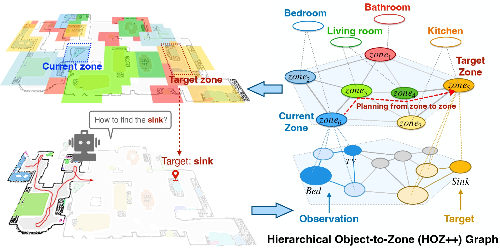

# HOZ++: Versatile Hierarchical Object-to-Zone Graph for Object Navigation

## Abstract

We propose the Hierarchical Object-to-Zone (HOZ++) graph, which encapsulates the regularities among objects, zones, and scenes. The HOZ++ graph helps the agent to identify the current zone and the target zone, and computes an optimal path between them, then selects the next zone along the path as the guidance for the agent. Moreover, the HOZ++ graph continuously updates based on real-time observations in new environments, thereby enhancing its adaptability to new environments. Our HOZ++ graph is versatile and can be integrated into existing methods, including end-to-end RL and modular methods.

|  |
|:------------------------------------------------:|

This project is divided into two main components:

1. **Pre-construction of HOZ++ graph**
2. **Navigation with HOZ++ graph**

## 1. Pre-construction of HOZ++ graph

The graph pre-construction process is managed within the `graph_construction` directory. 

Follow the instructions provided in the `graph_construction/README.md` to prepare data and generate the HOZ++ graphs. This component includes example code for constructing graphs using the AI2THOR and Gibson simulators.

<!-- ### Features

- **Data Preparation:** Scripts and guidelines for preparing necessary data.
- **Graph Generation:** Tools to generate the hierarchical object-to-zone graphs.
- **Simulator Integration:** Example code demonstrating graph construction in AI2THOR and Gibson. -->

## 2. Object Navigation (ObjectNav) Task Code

We provide two navigation code for ObjectNav task based on HOZ++:

### 2.1 HOZ++ Implicit Guidance

Designed for end-to-end methods. The code is located in the `implicit_guidance` directory. 

Follow the `implicit_guidance/README.md` for instructions on data preparation, training, and testing.

### 2.2 HOZ++ Explicit Guidance

Designed for modular ObjectNav methods, the explicit guidance approach is found in the `explicit_guidance` directory. 

Follow the `explicit_guidance/README.md` for data preparation and testing. **Note:** This method does not require training.

## 3. Video Demo

https://github.com/user-attachments/assets/0612428c-9973-472d-b0a8-690acad3cb7b

- **RGB-D**: The agent's visual input at each moment.
- **Rviz**: Monitoring the agent's pose in real-time.
- **Semantic Map**: Constructed based on RGB-D visual observations.
- **HOZ++ Node**: Updated with new environmental observations, representing the probability of each object type within a zone.
- **HOZ++ Edge**: Represents the probability of distance between nodes (zones). To keep it clear, only the Candidate zone and Target zone are displayed, with deeper colors indicating higher probability of closer distance. Note: Multiple Candidate zones may belong to the same HOZ++ node.
- **Candidate Zone**: The probability of each candidate zone (depicted with deeper red indicating higher probability) is determined based on both the semantic map, which records frontiers and explored trajectories, and the HOZ++ graph, which utilizes nodes for localization and edges for distance inference.
